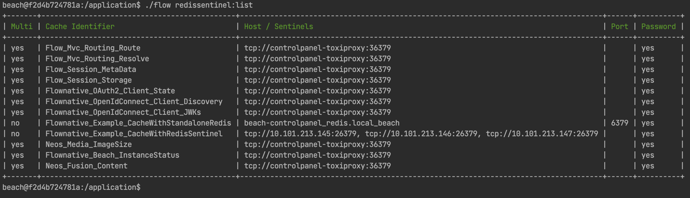
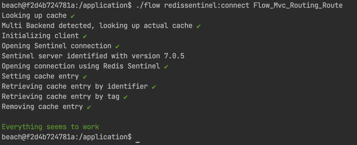
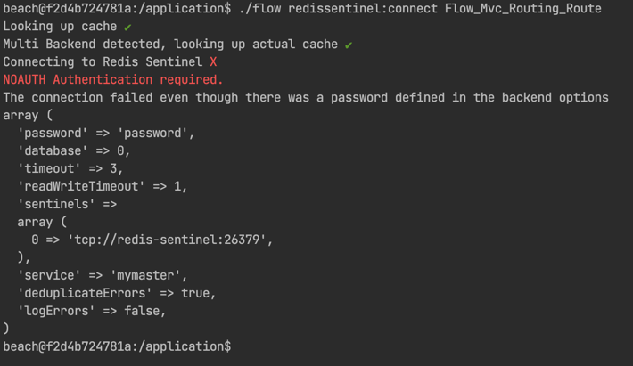

[](http://opensource.org/licenses/MIT)
[](https://packagist.org/packages/flownative/redis-sentinel)
[](https://www.flownative.com/en/products/open-source.html)

# Flow Redis Cache Backend with Sentinel Support

This package provides a Redis cache backend with
[Sentinel](https://redis.io/topics/sentinel) support.

## Installation

The package is installed as a regular Flow package via Composer. For your
existing project, simply include `flownative/redis-sentinel` into the
dependencies of your Flow or Neos distribution:

```bash
    $ composer require flownative/redis-sentinel:0.*
```

## Usage

The `RedisBackend` contained in this package can be used as a
drop-in-replacement for the Redis backend provided by the neos/cache package.

For regular use with a standalone Redis server, provide configuration in your
`Caches.yaml` like so:

```yaml
Flow_Mvc_Routing_Route:
    backend: 'Flownative\RedisSentinel\RedisBackend'
    backendOptions: &redisBackendOptions
        hostname: '%env:REDIS_HOST%'
        password: '%env:REDIS_PASSWORD%'
        port: '%env:REDIS_PORT%'
        database: 0
        timeout: 5
        readWriteTimeout: 0.5

Flow_Mvc_Routing_Resolve:
    backend: 'Flownative\RedisSentinel\RedisBackend'
    backendOptions: *redisBackendOptions
    …
```

Of course you can also set concrete values instead of using environment
variables.

Note that you can set two different timeouts:

- "timeout" (default: 5) specifies the time in seconds to wait while 
  connecting to Redis
- "readWriteTimeout" (default: 1) specifies the time to wait during a read 
  or write operation

You can specify float numbers as timeout values. For example, use `0.5` for 
setting the timeout to half a second.

When Redis is running in a high availability setup with Sentinel servers, you
need to configure the Redis Backend to access the Sentinel servers instead of
the actual Redis nodes.

Depending on your setup, this may look like the following:

```yaml
Flow_Mvc_Routing_Route:
    backend: 'Flownative\RedisSentinel\RedisBackend'
    backendOptions: &backendOptions
        sentinels:
            - 'redis://10.101.213.145:26379'
            - 'redis://10.101.213.146:26379'
            - 'redis://10.101.213.147:26379'
        service: 'mymaster'
        password: 'a-very-long-password'
        database: 0
        timeout: 0.5
        readWriteTimeout: 0.1

Flow_Mvc_Routing_Resolve:
    backend: 'Flownative\RedisSentinel\RedisBackend'
    backendOptions: *backendOptions
    …
``` 

Note that "service" is the name of your Redis cluster (which is "mymaster" in
most default configurations).

If your Sentinels are protected with a password, you must specify the 
password via the Sentinel URLs (due to how Predis works internally). Note 
that no username is specified, but you must not forget the colon ":" before 
the password:

```yaml
Flow_Mvc_Routing_Route:
    backend: 'Flownative\RedisSentinel\RedisBackend'
    backendOptions: &backendOptions
        sentinels:
            - 'redis://:sentinel-password@10.101.213.145:26379'
            - 'redis://:sentinel-password@10.101.213.146:26379'
            - 'redis://:sentinel-password@10.101.213.147:26379'
        service: 'mymaster'
        password: 'a-very-long-password'
        database: 0
        timeout: 0.5
        readWriteTimeout: 0.1

Flow_Mvc_Routing_Resolve:
    backend: 'Flownative\RedisSentinel\RedisBackend'
    backendOptions: *backendOptions
    …
```
## Logging

This cache backend will log errors, such as connection timeouts or other
problems while communicating with the Redis servers.

If a connection error occurs during a request, it is likely, that more errors of
the same type will happen. Therefore, those messages will, by default, be
de-duplicated: If the messages of an error is identical with one which already
has been logged during the current CLI / web request, it will not be logged
another time.

You can disable de-duplication logged errors for debugging purposes by
setting the respective backend option to false:

```yaml
Flow_Mvc_Routing_Route:
    backend: 'Flownative\RedisSentinel\RedisBackend'
    backendOptions:
        database: 0
        …
        deduplicateErrors: false
```

If you don't want errors being logged – for example, because you log errors via
the MultiBackend – you can turn off logging for this cache backend:

```yaml
Flow_Mvc_Routing_Route:
    backend: 'Flownative\RedisSentinel\RedisBackend'
    backendOptions:
        database: 0
        …
        logErrors: false
```

## Command Line Tool

This package provides CLI commands which can help debugging configuration or 
connectivity issues.

### redissentinel:list

Displays configuration of Redis Sentinel cache backends, including those 
backends which are defined as a sub-backend of a Multi Backend. 



### redissentinel:connect

Tries to connect with the specified cache. If the cache is using a Multi 
Backend, this command will skip the Multi Backend behavior and instantiate 
the Redis Sentinel Backend directly. Errors are display and explained, if 
possible. 





## Tests

You can adjust the host, port and password used in the functional tests 
using the environment variables `REDIS_HOST`, `REDIS_PORT` and `REDIS_PASSWORD`.

## Credits

This cache backend was developed by Robert Lemke of Flownative, based on the
Neos Flow Redis Backend, originally created by Christopher Hlubek and later
improved by the Neos core team. 
